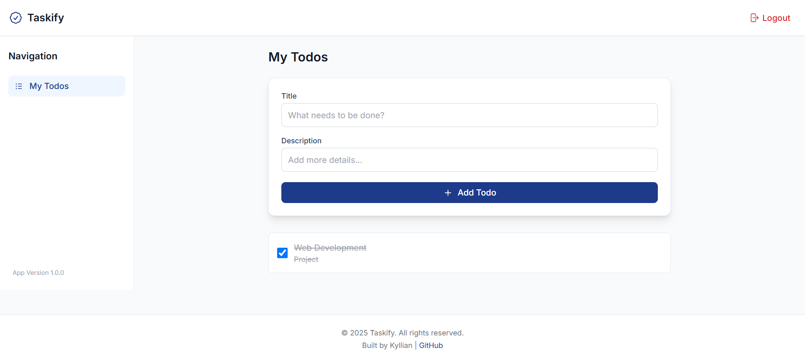

# Taskify - Your Simple Todo List

Welcome to Taskify, a sleek and efficient Todo List application crafted with cutting-edge frontend technologies. Built using Vue.js, Vite, and UnoCSS, Taskify empowers users to organize their tasks effortlessly with a modern, responsive interface. Whether you're signing up for the first time or managing your daily todos, Taskify delivers a seamless and visually appealing experience.

## Features

Taskify is packed with functionality to showcase both usability and technical prowess:

- **User Authentication**: Secure sign-up and sign-in workflows.
- **CRUD Operations**: Create, read, update, and delete todos with ease.
- **Task Management**: Mark todos as completed or edit their details on the fly.
- **Responsive Design**: Optimized for desktops, tablets, and mobile devices.
- **Modern Styling**: Powered by UnoCSS for a clean and elegant UI.

## Screenshots



## Live Demo

Check out the live version of Taskify at: https://webdev-kyllian.netlify.app/

## Installation

Follow these straightforward steps to get Taskify running on your local machine:

1. **Clone the Repository**:
```bash
git clone https://github.com/KyllianGenot/Web-Dev.git
```

2. **Navigate to the Project Directory**:
```bash
cd Web-Dev
```

3. **Install Dependencies**:
```bash
npm install
```

4. **Launch the Development Server**:
```bash
npm run start
```

5. **Access the App**: Open your browser and go to http://127.0.0.1:5173.

**Prerequisites**: Ensure you have Node.js and npm installed.

## Usage

Here's how to make the most of Taskify:

1. **Sign Up**: Register a new account with your username, email, and password.
2. **Sign In**: Log in using your credentials.
3. **Add a Todo**: Click "Add Todo," then enter a title and description.
4. **Manage Your Tasks**: Check off completed todos, edit details, or remove tasks as needed.

## Technologies

Taskify leverages a modern tech stack to deliver a high-quality application:

- **Vue.js 3**: Reactive and component-based framework for building the UI.
- **Vite**: Lightning-fast build tool for an optimized development experience.
- **UnoCSS**: Utility-first CSS framework for rapid and flexible styling.
- **TypeScript**: Static typing for cleaner, more reliable code.
- **Heroicons**: Elegant icons to enhance the visual design.
- **Vue Router**: Seamless navigation between views.

## Project Structure

Here's a glimpse into Taskify's organized codebase:

```
WEB-DEV [WSL: UBUNTU]
├── node_modules              # Project dependencies
├── public                    # Static assets
│   └── _redirects            # Redirect rules (if applicable)
├── src                       # Source code
│   ├── api-client            # API communication layer
│   │   └── api-client.js     # Client-side API logic
│   ├── components            # Reusable Vue components
│   │   ├── todos             # Todo-related components
│   │   │   ├── CreateTodo.vue    # Form for adding todos
│   │   │   ├── EditTodoModal.vue # Modal for editing todos
│   │   │   ├── TodoItem.vue      # Individual todo display
│   │   │   └── TodoList.vue      # List of todos
│   │   ├── AppHeader.vue     # Application header
│   │   ├── BasicInput.vue    # Reusable input component
│   │   ├── SignIn.vue        # Sign-in form
│   │   ├── SignUp.vue        # Sign-up form
│   │   └── Todos.vue         # Main todos view
│   ├── services              # Business logic
│   │   └── TodoService.ts    # Todo-related service layer
│   ├── shims-vue.d.ts        # TypeScript shims for Vue
│   ├── App.vue               # Root Vue component
│   ├── config.js             # Configuration settings
│   ├── main.css              # Global styles
│   ├── main.js               # Application entry point
├── .gitignore                # Git ignore rules
├── index.html                # HTML entry point
├── LICENSE                   # License file
├── package-lock.json         # Dependency lock file
├── package.json              # Project metadata and scripts
├── README.md                 # This file
├── tsconfig.json             # TypeScript configuration
├── uno.config.ts             # UnoCSS configuration
└── vite.config.ts            # Vite configuration
```

This structure reflects a modular, maintainable approach to frontend development, making it easy to navigate and extend.

## License

Taskify is released under the MIT License. See the LICENSE file for full details.